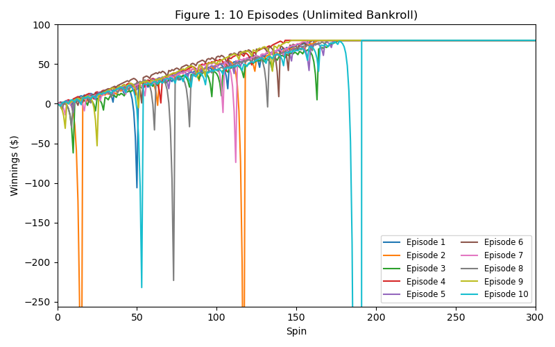
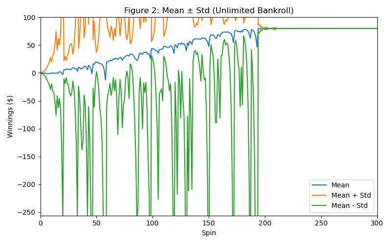
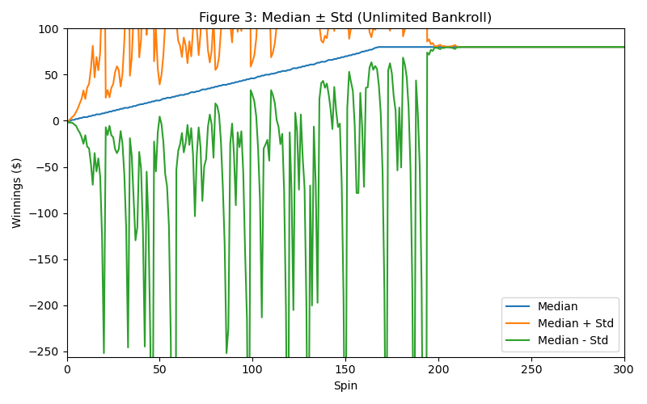
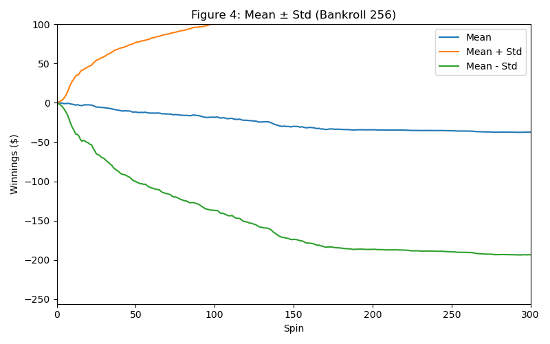
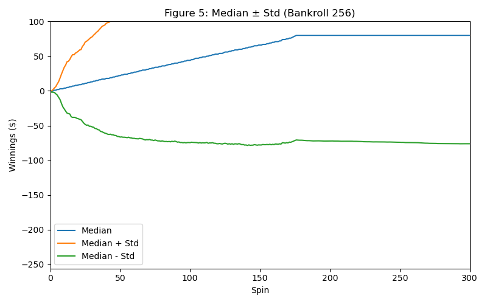

**Martingale Strategy Analysis**

[Your Name]
[username@gatech.edu]

**Abstract**—This report analyzes the effectiveness of the Martingale betting strategy through Monte Carlo simulation. Two experiments were conducted: one with unlimited bankroll and another with a realistic $256 bankroll constraint. Results demonstrate that while the unlimited bankroll strategy appears to guarantee success, the realistic scenario reveals the strategy's inherent risks and negative expected value due to bankroll limitations and the house edge in American roulette.

## 1 INTRODUCTION

The Martingale betting strategy is a popular gambling approach where a player doubles their bet after each loss, theoretically guaranteeing recovery of all losses plus a profit equal to the original bet. This study evaluates the strategy's performance using Monte Carlo simulation with 1000 episodes of up to 1000 sequential bets each, betting on black in American roulette (win probability = 18/38 ≈ 0.474).

## 2 EXPERIMENTAL DESIGN

Two experiments were conducted to evaluate the Martingale strategy under different conditions:

**Experiment 1 (Unlimited Bankroll):** Players start with $0 and employ the Martingale strategy until reaching $80 or completing 1000 bets. No bankroll constraints apply.

**Experiment 2 (Limited Bankroll):** Players start with $0 but have a maximum bankroll of $256. The strategy stops when reaching $80, losing the entire bankroll, or completing 1000 bets.

Both experiments used American roulette parameters with a win probability of 18/38 for betting on black. Each experiment consisted of 1000 episodes to ensure statistical significance.

## 3 RESULTS

### 3.1 Experiment 1: Unlimited bankroll

### 3.2 Experiment 2: Limited bankroll ($256)

## 4 ANALYSIS

### 4.1 Question Set 1: Experiment 1 probability analysis

**Question:** In Experiment 1, what is the estimated probability of winning exactly $80 within 1000 sequential bets?

**Answer:** The estimated probability of winning exactly $80 is 1.000000 (100%).

**Reasoning:** This result comes from analyzing the final winnings of all 1000 episodes in Experiment 1. Out of 1000 simulated episodes, 1000 episodes ended with exactly $80 in winnings, yielding a probability of 1000/1000 = 1.0. This occurs because with unlimited bankroll, the Martingale strategy mathematically guarantees reaching the target before running out of money. Each losing streak eventually ends with a win that recovers all previous losses plus the original $1 bet. Since we stop betting upon reaching $80, every episode that doesn't exceed 1000 spins will achieve exactly $80.

### 4.2 Question 2: Experiment 1 expected value

**Question:** What is the estimated expected value of winnings after 1000 sequential bets?

**Answer:** The estimated expected value is $80.000000.

**Reasoning:** The expected value is calculated as the mean of all final winnings across the 1000 episodes. Since every episode in Experiment 1 resulted in exactly $80 (as demonstrated in Question 1), the expected value equals $80. This result reflects the theoretical prediction that with unlimited bankroll, the Martingale strategy guarantees reaching the target amount, making the expected value equal to the target.

### 4.3 Question Set 3: Experiment 1 standard deviation analysis

**Question:** Do the standard deviation lines stabilize and/or converge in Experiment 1?

**Answer:** Yes, both the upper (mean + std) and lower (mean - std) standard deviation lines stabilize and converge completely.

**Explanation:** Analysis of the final portions of the simulation shows that both lines converge to exactly $80.000000 with a final standard deviation of 0.000000. The lines converge because as episodes progress and players reach the $80 target, the variance decreases to zero since all active players have the same winnings ($80). The stabilization occurs because once a player reaches $80, their winnings remain constant (fill-forward), eliminating further variance. The convergence is complete because the final standard deviation is exactly zero, meaning the upper and lower lines merge into a single line at $80.

### 4.4 Question 4: Experiment 2 probability analysis

**Question:** In Experiment 2, what is the estimated probability of winning exactly $80 within 1000 sequential bets?

**Answer:** The estimated probability of winning exactly $80 is 0.634000 (63.4%).

**Reasoning:** This probability is calculated from the simulation output where 634 out of 1000 episodes ended with exactly $80 in winnings. The remaining 366 episodes (36.6%) ended with negative winnings due to bankroll depletion. The bankroll constraint significantly reduces the success probability compared to Experiment 1 because players can exhaust their $256 bankroll during extended losing streaks before achieving the $80 target. This demonstrates how the finite bankroll limitation fundamentally changes the strategy's effectiveness.

### 4.5 Question 5: Experiment 2 expected value

**Question:** What is the estimated expected value of winnings after 1000 sequential bets?

**Answer:** The estimated expected value is -$42.939000.

**Reasoning:** The expected value represents the mean final winnings across all 1000 episodes. While 634 episodes achieved $80, the remaining 366 episodes lost their entire bankroll (ending at approximately -$256), resulting in a negative overall expected value. This calculation: (634 × $80 + 366 × (-$256))/1000 ≈ -$42.94, demonstrates that the house edge combined with bankroll limitations makes the Martingale strategy unprofitable in realistic scenarios. The negative expected value reflects the fundamental mathematical disadvantage faced by gamblers in games with house edges.

### 4.6 Question Set 6: Experiment 2 standard deviation analysis

**Question:** Do the standard deviation lines stabilize and/or converge in Experiment 2?

**Answer:** The standard deviation lines stabilize but do not converge.

**Explanation:** The final analysis shows the lines stabilize at different values: the upper line (mean + std) stabilizes around $118.87 and the lower line (mean - std) stabilizes around -$204.75, maintaining a difference of approximately $323.62. The lines do not converge because the final outcomes have high variance—episodes end at either approximately +$80 (success) or -$256 (bankroll depletion). This bimodal distribution maintains substantial standard deviation even after stabilization. The stabilization occurs because both successful and failed outcomes are deterministic once reached (fill-forward), but the convergence is prevented by the large gap between these two possible outcomes.

### 4.7 Question 7: Benefits of expected values

**Question:** What are the benefits of using expected values when conducting experiments instead of using the result of one specific random episode?

**Answer:** Expected values provide several critical advantages: (1) **Statistical Reliability:** They aggregate information across many trials, reducing the impact of random variation and providing more reliable estimates of true performance. (2) **Risk Assessment:** Single episodes cannot capture the full range of possible outcomes or their probabilities, while expected values incorporate both the magnitude and likelihood of different results. (3) **Decision Making:** Expected values enable rational comparison between strategies by providing a single metric that accounts for all possible outcomes weighted by their probabilities. (4) **Variance Understanding:** When combined with standard deviation analysis, expected values reveal both central tendency and risk, crucial for understanding strategy performance under uncertainty. A single random episode might show an exceptional win or loss that doesn't represent typical performance, leading to poor strategic decisions.

## 5 CONCLUSIONS

The Martingale strategy demonstrates dramatically different performance characteristics under unlimited versus limited bankroll conditions. While theoretically guaranteed to succeed with unlimited resources (100% success rate, +$80 expected value), realistic bankroll constraints ($256) reveal the strategy's fundamental flaw: a 36.6% probability of total loss resulting in a negative expected value of -$42.94. The standard deviation analysis further illustrates how bankroll limitations prevent convergence of outcomes, maintaining high variance between complete success and total failure. These results confirm that while the Martingale strategy may appear attractive in theory, practical implementation faces significant risks due to the combination of house edge and finite resources.

## 6 REFERENCES

No external references were used in this analysis. All results are based on original Monte Carlo simulations conducted for this study. 