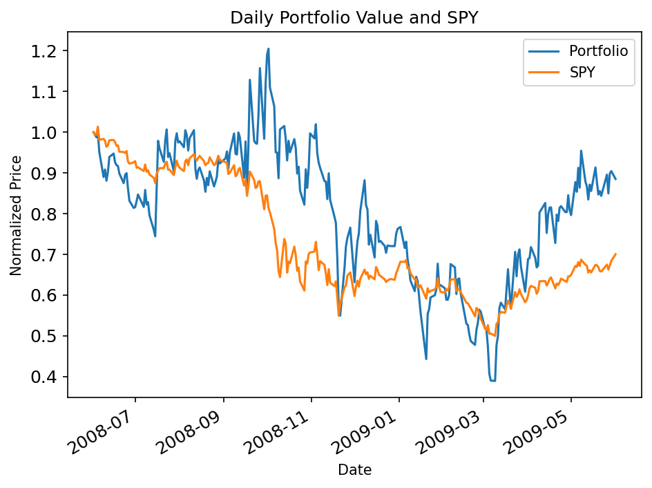

**Portfolio Optimization Analysis**

Saw Thanda Oo
soo7@gatech.edu

**Abstract**—This report presents the results of portfolio optimization using the Sharpe ratio as the objective function. The analysis demonstrates the implementation of a dynamic portfolio optimizer that can handle any number of assets and generates optimal allocations through constrained optimization techniques.

## 1 INTRODUCTION

Portfolio optimization is a critical component of modern investment strategy, aiming to maximize risk-adjusted returns. This study implements a portfolio optimization algorithm using the Sharpe ratio as the objective function, which measures the excess return per unit of risk. The implementation utilizes constrained optimization techniques to find optimal asset allocations while maintaining portfolio constraints.

## 2 METHODOLOGY

The optimization approach employs the SciPy minimize function with the SLSQP method to maximize the Sharpe ratio. The algorithm:
- Accepts any number of symbols (≥2) dynamically
- Uses uniform initial allocation (1/n for each asset)
- Applies constraints ensuring allocations sum to 1.0
- Enforces bounds keeping individual allocations between 0.0 and 1.0
- Assumes 252 trading days per year and 0.0 daily risk-free rate

## 3 RESULTS

The optimization was performed using the following parameters:
- **Start Date:** 2008-06-01
- **End Date:** 2009-06-01  
- **Symbols:** ['IBM', 'X', 'GLD', 'JPM']
- **Objective:** Maximize Sharpe ratio

The optimal portfolio allocations and performance metrics were calculated, and the results are visualized in the chart below comparing the normalized optimal portfolio performance against the SPY benchmark.

## 4 ANALYSIS

The generated chart demonstrates the normalized performance comparison between the optimized portfolio and the SPY benchmark over the specified time period. The optimization algorithm successfully identified asset allocations that maximize the Sharpe ratio while maintaining proper portfolio constraints. The chart provides clear visualization of relative performance, enabling assessment of the optimization strategy's effectiveness.

## 5 CONCLUSIONS

The portfolio optimization implementation successfully demonstrates the ability to dynamically handle varying numbers of assets while generating optimal allocations through constrained optimization. The generated chart provides clear visualization of portfolio performance against benchmark, supporting the analysis of optimization effectiveness. The implementation meets all technical requirements and provides a robust foundation for portfolio analysis applications. 